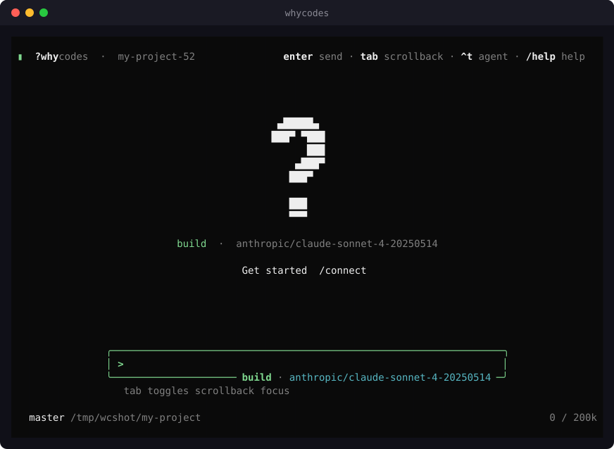

<p align="center">
  
</p>

<p align="center">
  <a href="https://github.com/whycorporation/whycodes/actions/workflows/ci.yml"></a>
  <a href="https://github.com/whycorporation/whycodes/releases"></a>
  <a href="LICENSE"></a>
</p>

**A fast, provider-independent coding agent for the terminal, written in Rust.**

WhyCodes reads, writes and edits files, runs commands, searches the workspace
and drives an LLM through multi-turn tool use — in a full-screen TUI or as a
machine-readable one-shot CLI. It focuses on a small native footprint, an
idle-efficient TUI, and a workflow that is not tied to any single model
provider.

<p align="center">
  
</p>

## Highlights

- **One native binary.** No required runtime dependencies. Search is
  in-process (`ripgrep` not needed); optional OS integrations such as Linux
  bubblewrap strengthen sandboxing when available.
- **Cross-platform.** The same workflow on Linux, macOS and Windows. Linux
  runs on every CI change; Windows and macOS jobs are available through the
  multi-OS CI matrix.
- **Any provider.** Anthropic, OpenAI, Google, GitHub Copilot, Groq, xAI,
  DeepSeek, Ollama, OpenRouter, Mistral, Together, or any OpenAI-compatible
  endpoint — with an API key or a subscription login (`whycodes auth login`).
- **Fits your project.** Loads project instructions from `AGENTS.md` and
  connects to existing MCP tools and language servers over LSP.
- **Remembers your work.** Persisted sessions, cross-session memory
  (`MEMORY.md`, semantic recall) and an optional code index.

## Installation

### Install script (Linux, macOS)

```bash
curl -fsSL https://why.codes/install | bash
```

### Install script (Windows)

```powershell
irm https://why.codes/install.ps1 | iex
```

### Homebrew (macOS; Linuxbrew x86_64)

```bash
brew tap whycorporation/whycodes https://github.com/whycorporation/whycodes
brew install whycorporation/whycodes/whycodes
```

Homebrew 6+ refuses untrusted third-party taps. The fully-qualified install
trusts only this formula. If you already tapped and saw that error:

```bash
brew trust --formula whycorporation/whycodes/whycodes
brew install whycodes
```

### From source

```bash
cargo build --release -p whycodes-cli
```

Update with `whycodes upgrade` (script / cargo installs) or `brew upgrade
whycodes` (Homebrew). Interactive TUI sessions check GitHub for a newer
release and ask on the home screen before installing. Pass `--no-auto-update`
to skip the prompt. The install scripts verify
release artifacts against the published `SHA256SUMS`. Downloadable binaries
and uninstall instructions:
[docs/packaging.md](docs/packaging.md).

<details>
<summary>Shell completions</summary>

```bash
eval "$(whycodes completions zsh)"    # ~/.zshrc
eval "$(whycodes completions bash)"   # ~/.bashrc
whycodes completions fish > ~/.config/fish/completions/whycodes.fish
```

</details>

## Quick start

```bash
export ANTHROPIC_API_KEY="sk-ant-..."

whycodes -d ./my-project                            # interactive TUI
whycodes generate "Explain main.rs" -d ./my-project # one-shot
whycodes generate "Summarize the last commit" --format json
whycodes --continue                                 # resume last session
whycodes -P openai -m gpt-4o generate "Refactor this module"
```

Subscription OAuth login (`whycodes auth login <provider>`) is available
only after installing a local `kind: "auth"` plugin — WhyCodes ships no
third-party OAuth clients. See [docs/auth.md](docs/auth.md).

The full guide — CLI reference, TUI keys, slash commands, agents, tools and
configuration — is in **[docs/guide.md](docs/guide.md)**.

## Features

| | |
|---|---|
| **Agents** | `build` (full access), `plan` and `ask` (read-only) as primary agents; `general`, `explore` and `scout` subagents via the `task` tool; parallel workers in git worktrees via `swarm` |
| **Tools** | File edit/patch, in-process search, shell, git and GitHub, web fetch/search, a CDP-driven browser, background jobs, scheduling and to-do tracking |
| **Sessions** | Persisted per project; resume with `--continue` / `--resume`, import transcripts from other agent CLIs, share over the local server |
| **Memory** | Human-editable `MEMORY.md`, semantic facts with embeddings, optional code RAG index — all per project, all optional |
| **Headless / CI** | `generate` with `--format json` or `stream-json` (NDJSON), multiple prompts run concurrently, non-zero exit on failure |
| **Safety** | Permission gates per tool, shell command risk analysis, an optional OS sandbox (bubblewrap), HTTP domain allowlists and tool hooks |
| **Extensibility** | MCP servers (stdio and HTTP), LSP language servers, skills, shell plugins, custom slash commands, themes |
| **Embedding** | Rust and TypeScript SDKs over daemon protocol v1 (`whycodes serve`) |

## Performance

Idle TUI, Linux x86_64, 2026-09-02 (method and machine in
[docs/benchmarks.md](docs/benchmarks.md)):

| Metric | Result |
|---|---|
| 1 session PSS | **12.1 MB** |
| 10 sessions PSS | **30.4 MB** (~2.0 MB each extra) |
| `--version` | **2.0 ms** |
| First frame (harness, in-proc) | **13 ms** |
| Idle redraws (harness, 3 s) | **0.3 /s** |

The TUI paints only when something changed. This run’s 3 s harness idle is **0.3 redraws/s** (same as `50e05d8`; `ea098af` idle-zero gates did not restore a hard zero); the product target is still **0 redraws/s**, not a frames-per-second race.

Workspace line coverage is **85.58%** (Linux x86_64, 2026-08-21). CI fails
below 82%, with twelve foundational crates held at 100% production-code line
coverage — see [docs/coverage.md](docs/coverage.md).

## Documentation

| Doc | What it covers |
|---|---|
| [docs/guide.md](docs/guide.md) | Usage: CLI, TUI, agents, tools, config, SDK |
| [docs/auth.md](docs/auth.md) | API keys, OAuth, credential import |
| [docs/architecture.md](docs/architecture.md) | Crate map and layering |
| [docs/roadmap.md](docs/roadmap.md) | Current focus and deferred work |
| [docs/knowhow.md](docs/knowhow.md) | Hard-won bugs (TUI, tty, silent exits) |
| [docs/tui-term-matrix.md](docs/tui-term-matrix.md) | Manual TUI pass on Alacritty / Kitty / VTE |
| [docs/benchmarks.md](docs/benchmarks.md) | Measuring startup, RSS, idle draws |
| [docs/coverage.md](docs/coverage.md) | Measuring line coverage |
| [docs/budgets.md](docs/budgets.md) | CI quality budgets |
| [docs/packaging.md](docs/packaging.md) | Homebrew, installers, release download counts |

## Contributing

Contributions are welcome. [CONTRIBUTING.md](CONTRIBUTING.md) is the short
path from clone to a merged change; [AGENTS.md](AGENTS.md) holds the rules
for coding agents working in this repo. By participating you agree to the
[Code of Conduct](CODE_OF_CONDUCT.md). Help and bug reports: [SUPPORT.md](SUPPORT.md).
Please report vulnerabilities through [SECURITY.md](SECURITY.md), not public
issues.

## License

[MIT](LICENSE) · [why.codes](https://why.codes)
